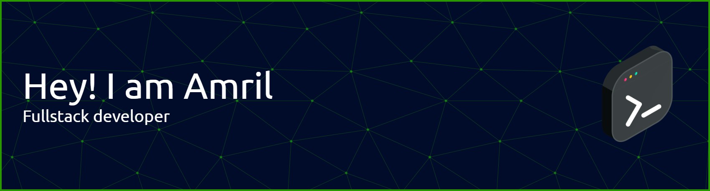

## Hi there, I'am Amril 👋

My Full-Stack Developer Project Portfolio. This repository serves as a gallery for all the end-to-end projects I have developed. Each project includes a technical breakdown, the technologies used, and the challenges I successfully overcame. Explore the code to see how I integrate various technologies to create seamless user experiences and robust backend functionality.

🌱 I’m currently learning golang for make a backend services
⚡ Fun fact: Very fun to learn program😁

### Skills

### Connect with me
 

<!--
**amril10/amril10** is a ✨ _special_ ✨ repository because its `README.md` (this file) appears on your GitHub profile.

Here are some ideas to get you started:

- 🔭 I’m currently working on ...
- 🌱 I’m currently learning ...
- 👯 I’m looking to collaborate on ...
- 🤔 I’m looking for help with ...
- 💬 Ask me about ...
- 📫 How to reach me: ...
- 😄 Pronouns: ...
- ⚡ Fun fact: ...
-->

